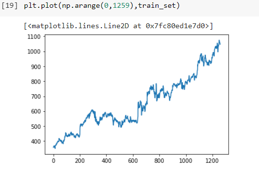

# Stock Price Prediction

## AIM

To develop a Recurrent Neural Network model for stock price prediction.

## Problem Statement and Dataset

Develop a Recurrent Neural Network model for stock price prediction using the stock prediction dataset

## Neural Network Model

## DESIGN STEPS

### STEP 1:
Import the required pakages and upload both train and test datasetets.
### STEP 2:
 Seprate the train datas into the input and output.conver the array into numpy.
### STEP 3:
Create a RNN model.
### STEP 4:
 Combine the two dataset into one dataset to predict the price of the up coming years
### STEP 5 :
 Scale the dataset after combining it , after scaling it use inverse to convert the scaled value into the practical value.
### STEP 6 :
 Finally plot the predicted values
## PROGRAM

DEVELOPED BY :Meiyarasi.V
REGISTER NUMBER :212221230058
~~~
import numpy as np
import matplotlib.pyplot as plt
import pandas as pd
from sklearn.preprocessing import MinMaxScaler
from keras import layers
from keras.models import Sequential
dataset_train = pd.read_csv('trainset.csv')
dataset_train.columns
dataset_train.head()
dataset_train.head()
dataset_train.tail()
dataset_train.tail()
dataset_train.iloc[1256:1258]
train_set = dataset_train.iloc[:,1:2].values
type(train_set)
train_set.shape
plt.plot(np.arange(0,1259),train_set)
sc = MinMaxScaler(feature_range=(0,1))
training_set_scaled = sc.fit_transform(train_set)
training_set_scaled.shape
X_train_array = []
y_train_array = []
for i in range(60, 1259):
  X_train_array.append(training_set_scaled[i-60:i,0])
  y_train_array.append(training_set_scaled[i,0])
X_train, y_train = np.array(X_train_array), np.array(y_train_array)
X_train1 = X_train.reshape((X_train.shape[0], X_train.shape[1],1))
X_train.shape
length = 60
n_features = 1
model = Sequential()
model.add(layers.SimpleRNN(50,input_shape=(length,n_features)))
model.add(layers.Dense(1))
model.compile(optimizer='adam', loss='mse')
model.fit(X_train1,y_train,epochs=100, batch_size=32)
dataset_test = pd.read_csv('testset.csv')
dataset_test.head()
test_set = dataset_test.iloc[:,1:2].values
test_set.shape
dataset_total = pd.concat((dataset_train['Open'],dataset_test['Open']),axis=0)
dataset_total.shape
inputs = dataset_total.values
inputs
inputs = dataset_total.values
inputs = inputs.reshape(-1,1)
inputs_scaled=sc.transform(inputs)
X_test = []
Y_test=[]
for i in range(60,1384):
  X_test.append(inputs_scaled[i-60:i,0])
  Y_test.append(inputs_scaled[i,0])
X_test = np.array(X_test)
##increasing the shape here
X_test = np.reshape(X_test,(X_test.shape[0], X_test.shape[1],1))
predicted_stock_price_scaled = model.predict(X_test)
predicted_stock_price = sc.inverse_transform(predicted_stock_price_scaled)
plt.plot(np.arange(0,1384),inputs, color='red', label = 'Test(Real) Google stock price')
plt.plot(np.arange(60,1384),predicted_stock_price, color='blue', label = 'Predicted Google stock price')
plt.title('Google Stock Price Prediction')
plt.xlabel('Time')
plt.ylabel('Google Stock Price')
plt.legend()
plt.show()
from sklearn.metrics import mean_squared_error as mse
mse(Y_test,predicted_stock_price)
~~~

## OUTPUT

### Mean Square Error

## RESULT
Thus the prices are predicted for up coming years using given datasets.
